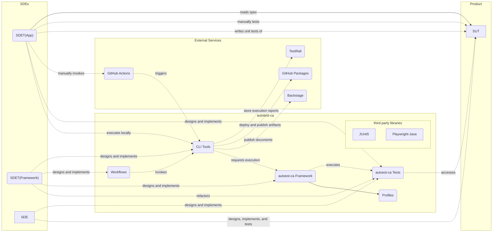
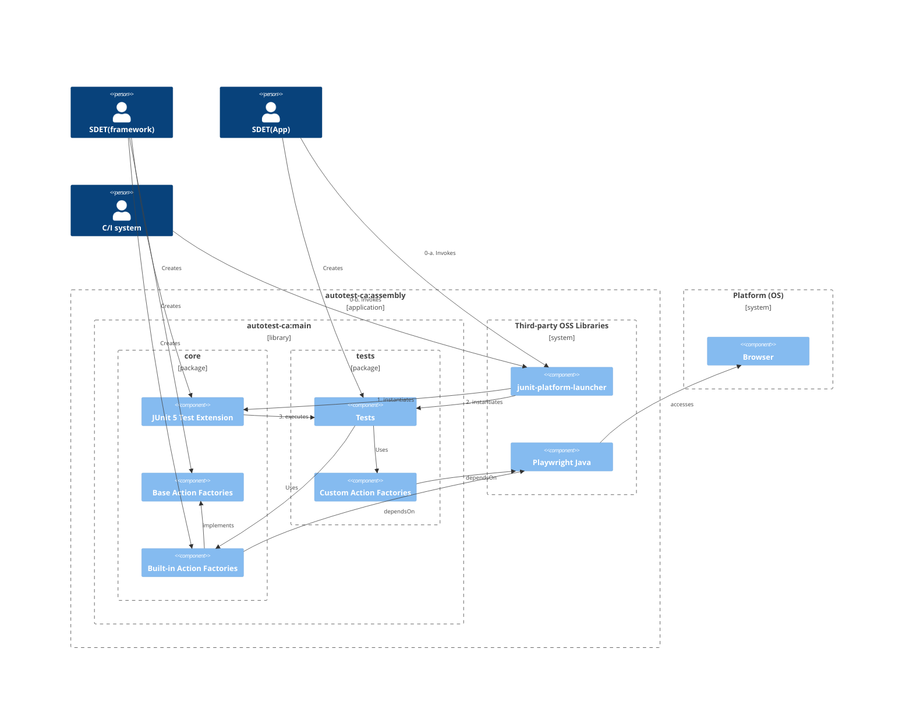
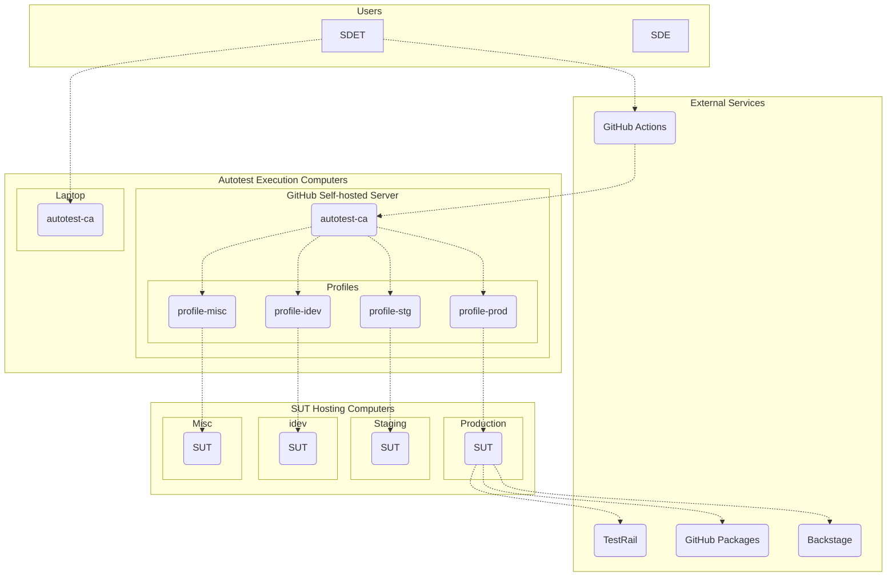

# Software Architecture

Following is a diagram that illustrates relationships between software components of **autotest-ca** and of external services.

Note that some interactions in this diagram from **SDET(app)** are done not only by them but also by other roles.

*Logical Integration:*

**CLI Tools** are designed to access external services and implement peripheral tasks around development efforts, such as building executables, publishing documentations, and executing tests.
They have in general entry-points in **Makefile**.
(GitHub) **Workflows** are implemented to hook triggers as wrappers to those **CLI Tools** 
They are not supposed to access external services or implements complex logics by themselves.
Instead, they should invoke **CLI tools** and be kept as light-weight as possible.
Insight behind this is a fact, where workflows of GitHub Actions are hard to test even with helps by `gh` utility command, that GitHub distributes.

**autotest-ca Framework** is a component responsible for executing tests defined as a part of **autotest-ca Tests** component.
The framework provides a **JUnit5** extension, which defines execution flow of tests.

**autotest-ca Profile** is a component that abstracts execution environments and parameters whose values can be different across test runs.

**SDET(App)** are responsible for executing/implementing tests for **SUT** in an automated-fashion as much as possible to meet projects' deadlines.
When necessary, they will execute tests by manual.
While **SDET(Framwork)** are responsible for making/keeping **SDET(App)** works efficient as much as possible.

## Internal

Following is a diagram more focusing on the detail of the static structure of the `autotest-ca`.
It is built as an executable assembly, which has all the necessary dependencies inside one file.

It is assumed that different set of people will work on each package.
`tests` will be developed by "SDET(App)", who are supposed to be assigned to a specific product/project and knowledgeable at its specifications and expertise in software testing.
They will conduct manual tests when necessary to meet project requirements.

The `core` will be developed by "SDET(Framework)", who are knowledgeable both at general software engineering and software testing.

In the current version  (version **1.0.0-SNAPSHOT**), `tests` and `core` will be placed in the same library module, however, when it goes to production, they will be belonging to different modules and different repositories.
This separation will be done as the product gets matured.

## "Profile" Mechanism

This is a diagram that illustrates relationships between components of **autotest-ca** and of external services at runtime.

*Profile Mechanism*

**autotest-ca** is designed to be able to run both on laptop computers and GitHub Self-hosted Server transparently.
Its tests are designed to be able to target known execution environments.
Differences between environments are abstracted by a mechanism called **Profile**.
Every component in **autotest-ca** should be designed to be able to run against known execution environments, such as "production", "staging", or "idev", by specifying a profile as a runtime parameter value passed to the CLI, without any single line change in the code.

Thus, every component of **autotest-ca** is meant to be testable.

More detail can be found in [Component Interactions](ComponentInteractions.md)

