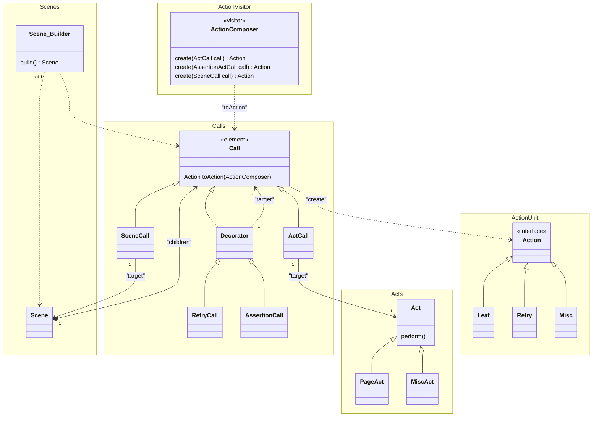
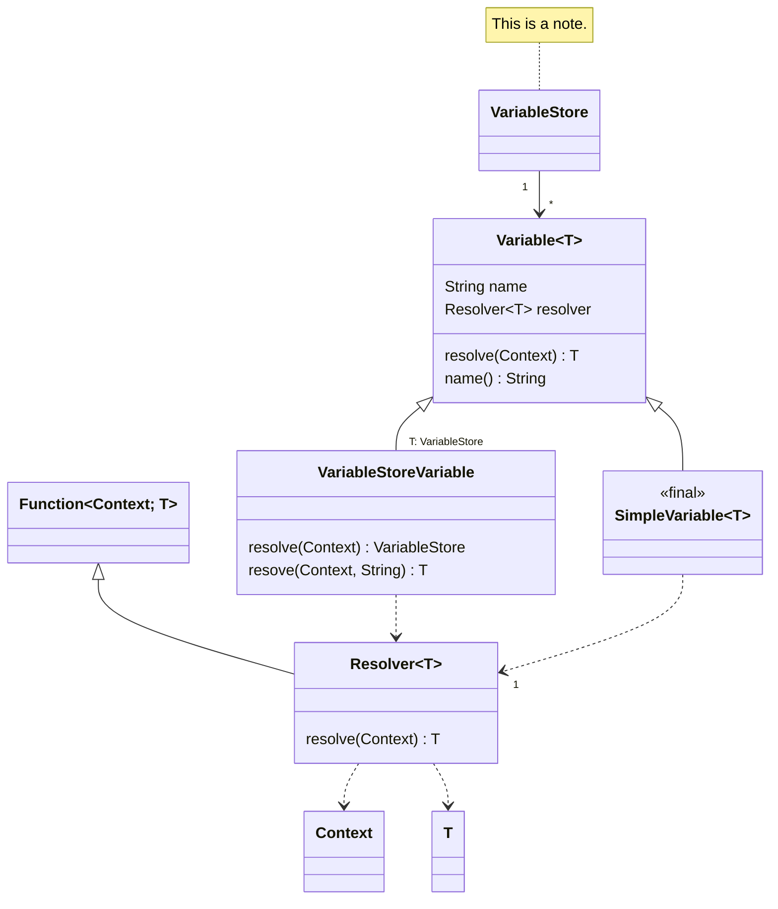
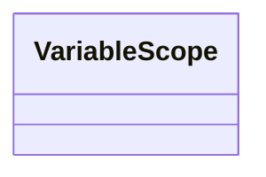
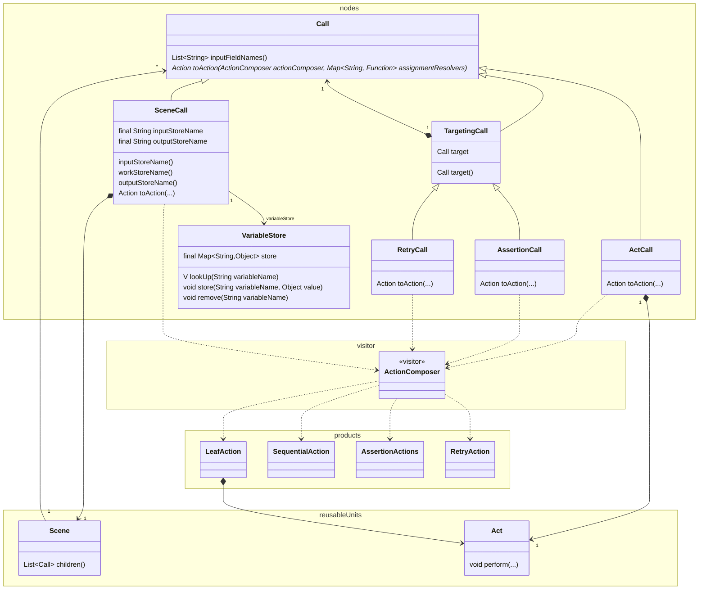
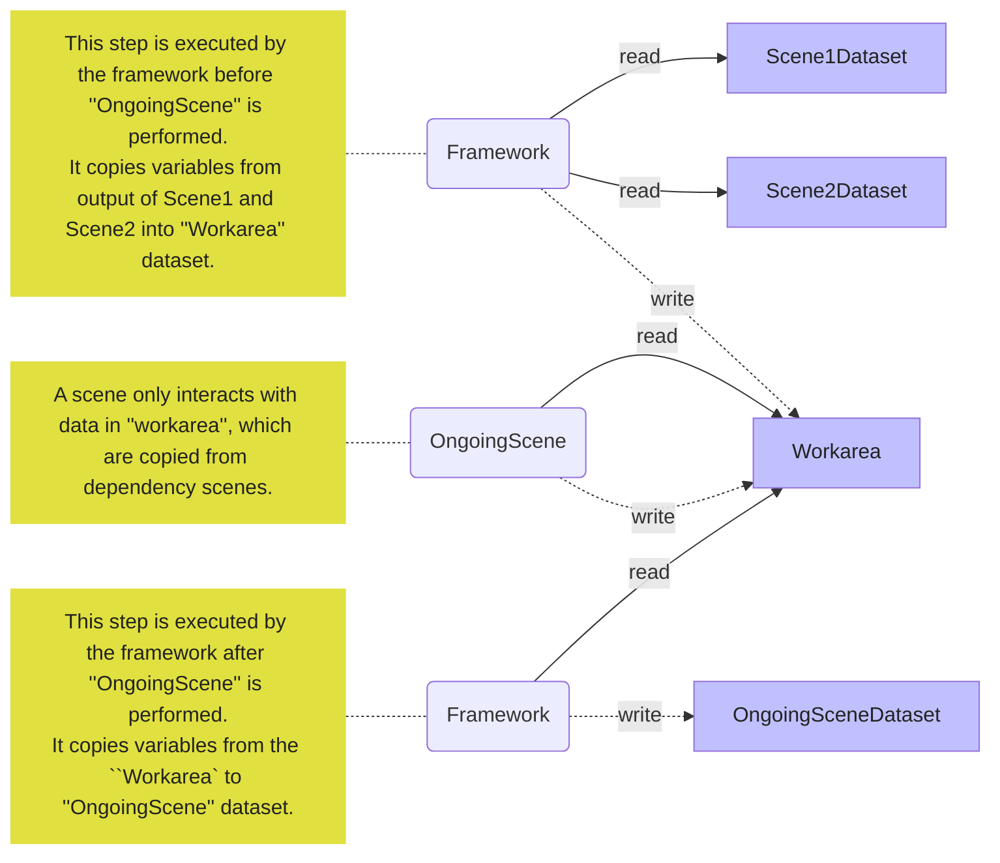

This is a package to provide "action" model of the **autotest-ca** framework.

Actions performed over the SUT are modeled as `Call` and `Act` in the framework, which creates `Action` using the concept of **actionunit** library.



In the concepts of the **autotest-ca** framework, a test consists of two elements.
**Scenes** and **Acts**.

A **Scene** is a structure of **Acts**.

**Act** can be implemented by a test programmer, typically **SDET-FW**, to model a reusable real world action such as **Click**, **Navigate**, **Screenshot**, etc.  

A **Scene** is a unit that the framework manipulates and executes.
A user programmer is expected to build a *Scene* to the execution framework in a way which it can recognize.
A call is defined for structural action such as ''leaf'', ''assertion'', ''sequential'', ''retry'', and so on.
An **Act** is a unit of a behavior, that user programmers can define as a Java code directly, and from which they build a scene.
**Calls** are classes to model an internal structure through which an **Action** (**actionunit**) tree is built.
It is held by `Scene.Builder` and translated into the tree by **ActionComposer**.

''**ActionComposer**'' and ''**Calls**'' consists a ''**Visitor**'' pattern.
A call is an 'element' in **Visitor** pattern.
''**ActionComposer**'' traverses ''**Calls**'' one by one and creates action tree to be executed.

## Data Storage Structure

A variable store is one form of a variable.
For clarity's sake, we introduce a "simple variable" to distinguish them without confusion.



In order to achieve "static scope" behavior, we have a mechanism described below:

t.b.d





## Data Management of Scenes and Acts

A scene and its acts have inputs and outputs.
Those variables are stored in a map, which is then a variable in a "context" of **actionunit**.
This map is called "variable-space" in this document.

**Scenes** and **Acts** interacts with each others through those variables in variable-spaces.
Dependencies between **Scenes** are described by annotations defined in user programs.
Following is an example that illustrates such interactions.

```java
import jp.co.moneyforward.autotest.framework.annotations.AutotestExecution;
import jp.co.moneyforward.autotest.framework.annotations.Export;
import jp.co.moneyforward.autotest.framework.annotations.Named;

@AutotestExecution("ongoingScene")
class ExampleAccessingModel {
  @Named
  @Export({"a", "b"})
  Scene scene1() {
    return someScene();
  }
  
  @Named
  @Export({"x", "y"})
  Scene scene2() {
    return someOtherScene();
  }
  
  @Named
  @DependsOn({"scene1", "scene2"})
  Scene ongoingScene() {
    return sceneForSomething();
  }
}
```

In this example, `ongoingScene` is designated as a method to create a scene to be executed as a test.
Since it `@DependsOn` `scene1` and `scene2`, the framework executes them, first.
As `scene1` `@Export`s `a` and `b`, they are stored in a variable-space of `scene1`.
Similarly, `x` and `y` are stored in `scene2`'s variable-space.

All those variables are copied into "Working variable-space", where a scene created by `ongoingScene` method is performed.
It may read and write variables in the space.
After the execution is finished, all the variables will be copied to its dedicated variable-space for `ongoingScene`.

**NOTE:** Instead of `@DependsOn`, you can use `@When`.
They are basically the same in terms of description capability of dependencies, just different in how they are executed.
Please check respective documentations for the differences.

Following is a diagram that illustrates this mechanism:



Note that an **Act** can have only one input and one output, while a scene has a set of such input and output variables (variable-space).
