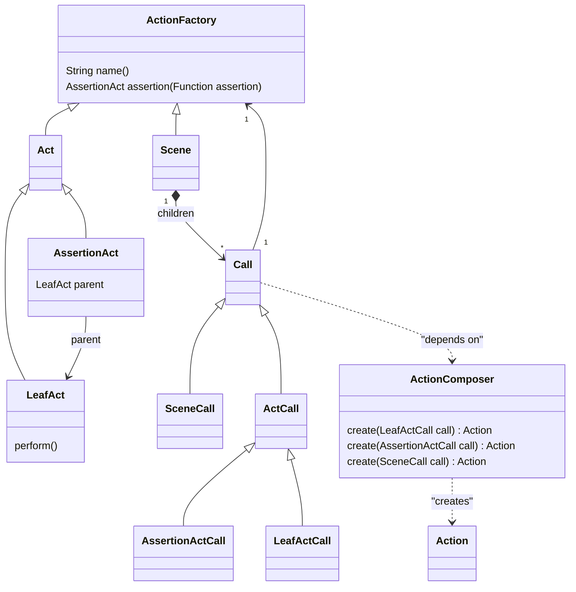

This is a package to provide "action" model of the **autotest** framework.

Actions performed over the SUT are modeled as `ActionFactory` in the framework, which creates `Action` using the concept of **actionunit** library.

Since one instance of `ActionFactory` corresponds to one `Action` instance in the model of this framework, we use the terms **action** and **action factory** interchangeably in the documentation.

In the concepts of the **autotest** framework, actions can be categorized into two, which are **Scenes** and **Acts**.
Then **Acts** are categorized into **AssertionAct** and **LeafAct**.
Each of them has corresponding **Call** class.

A **Scene** is a unit that the framework executes at the top level.
An **Act** is a unit of a behavior, that user can define as a Java code directly.

As the root class name **ActionFactory** suggests, these are defined to create **Action** instances.

In order to process the hierarchical structure which is represented by the composite pattern formed by a class tree under **ActionFactory**, the tree and **ActionComposer** forms a Visitor pattern.

