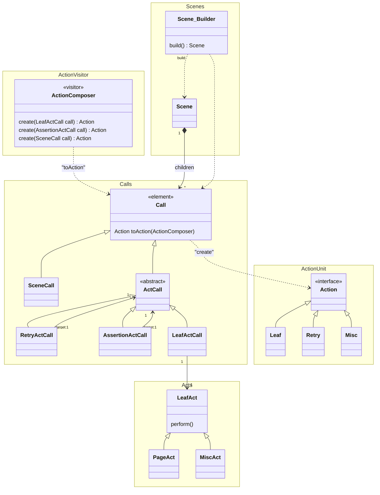
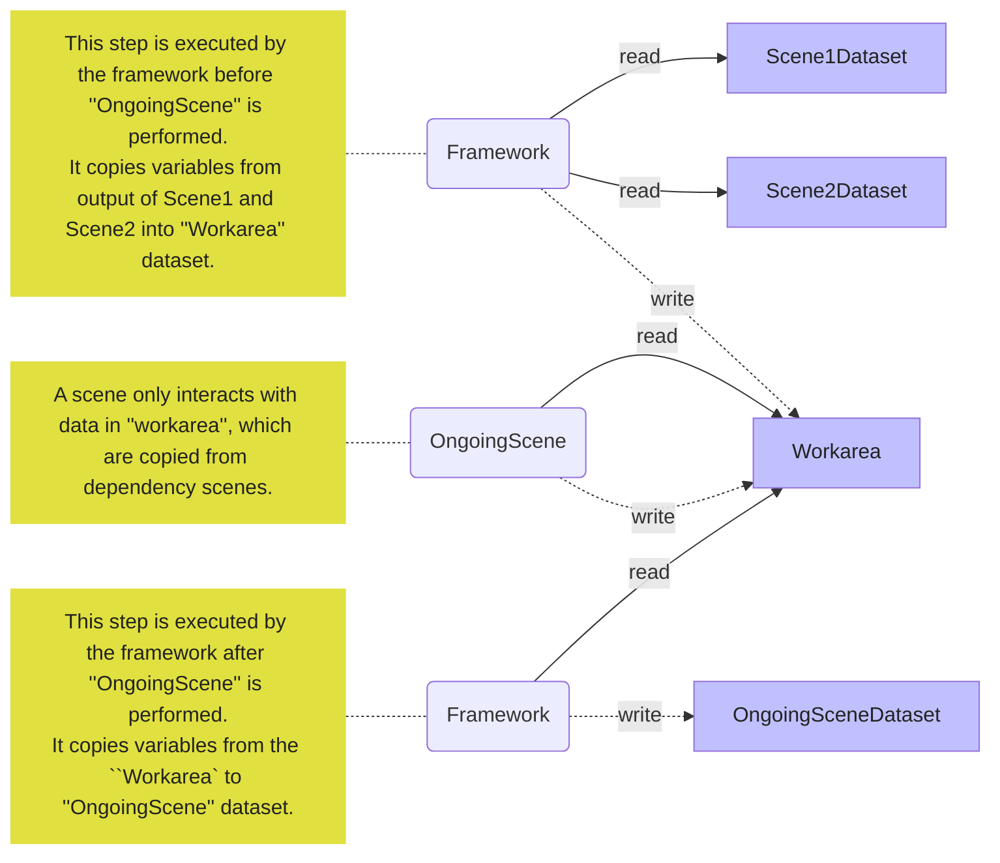

This is a package to provide "action" model of the **autotest-ca** framework.

Actions performed over the SUT are modeled as `ActionFactory` in the framework, which creates `Action` using the concept of **actionunit** library.

Since one instance of `ActionFactory` usually corresponds to one `Action` instance in the model of this framework, we use the terms **action** and **action factory** interchangeably in the documentation unless otherwise explicitly noted.



In the concepts of the **autotest-ca** framework, a test consists of two elements.
**Scenes** and **Acts**.

A **Scene** is a structure of **Acts**.

Ideally, a test class consists of methods returning **Scenes** only, each of which constructs a **Scene** by calling methods to create **Acts**.
Then, each of those method calls has meaningful name with meaningful variable names for arguments.

Thus, the test class should become a readable code, yet can be executed efficiently because the framework understands dependencies among **Scenes** and can avoid unnecessary arrangement steps. 

Then **Acts** are categorized into **AssertionAct** and **LeafAct**.
**LeafAct** can be implemented by a test programmer, typically **SDET-FW**, to model a reusable real world action such as **Click**, **Navigate**, **Screenshot**, etc.  

**AssertionAct** and **LeafAct** have corresponding **Call** class, which are **AssertionActCall** and **LefActCall**.
However, not individual **Act** classes such as **Click**.

A **Scene** is a unit that the framework executes at the top level.
An **Act** is a unit of a behavior, that user can define as a Java code directly.

As the root class name **ActionFactory** suggests, these are defined to create **Action** instances.

**Call**s are only defined for structurally meaning elements such as **SceneCall**, **AssertionAct**, **AssertionActCall**, **LeafActCall** or **RetryCall**.

In order to process the hierarchical structure which is represented by the composite pattern formed by a class tree under **ActionFactory**, the tree and **ActionComposer** forms a Visitor pattern.

note for ActionComposer "''ActionComposer'' and ''Calls'' consists a ''Visitor'' pattern.
''ActionComposer'' traverses ''Calls'' one by one and creates action tree to be executed."
note for Call "A call is an 'element' in 'Visitor' pattern.
Typically visited by 'ActionComposer' and creates an action (actionunit).
A call is defined for structural action such as ''leaf'', ''assertion'', ''sequential'', ''retry'', and so on.
"
note for Act "Act is a class that represents user-defined activity."

## Data Management of Scenes and Acts

A scene and its acts have inputs and outputs.
Those variables are stored in a map, which is then a variable in a "context" of **actionunit**.
This map is called "variable-space" in this document.

**Scenes** and **Acts** interacts with each others through those variables in variable-spaces.
Dependencies between **Scenes** are described by annotations defined in user programs.
Following is an example that illustrates such interactions.

```java
import jp.co.moneyforward.autotest.framework.annotations.AutotestExecution;
import jp.co.moneyforward.autotest.framework.annotations.Export;
import jp.co.moneyforward.autotest.framework.annotations.Named;

@AutotestExecution("ongoingScene")
class ExampleAccessingModel {
  @Named
  @Export({"a", "b"})
  Scene scene1() {
    return someScene();
  }
  
  @Named
  @Export({"x", "y"})
  Scene scene2() {
    return someOtherScene();
  }
  
  @Named
  @DependsOn({"scene1", "scene2"})
  Scene ongoingScene() {
    return sceneForSomething();
  }
}
```

In this example, `ongoingScene` is designated as a method to create a scene to be executed as a test.
Since it `@DependsOn` `scene1` and `scene2`, the framework executes them, first.
As `scene1` `@Export`s `a` and `b`, they are stored in a variable-space of `scene1`.
Similarly, `x` and `y` are stored in `scene2`'s variable-space.

All those variables are copied into "Working variable-space", where a scene created by `ongoingScene` method is performed.
It may read and write variables in the space.
After the execution is finished, all the variables will be copied to its dedicated variable-space for `ongoingScene`.

**NOTE:** Instead of `@DependsOn`, you can use `@When`.
They are basically the same in terms of description capability of dependencies, just different in how they are executed.
Please check respective documentations for the differences.

Following is a diagram that illustrates this mechanism:



Note that an **Act** can have only one input and one output, while a scene has a set of such input and output variables (variable-space).
