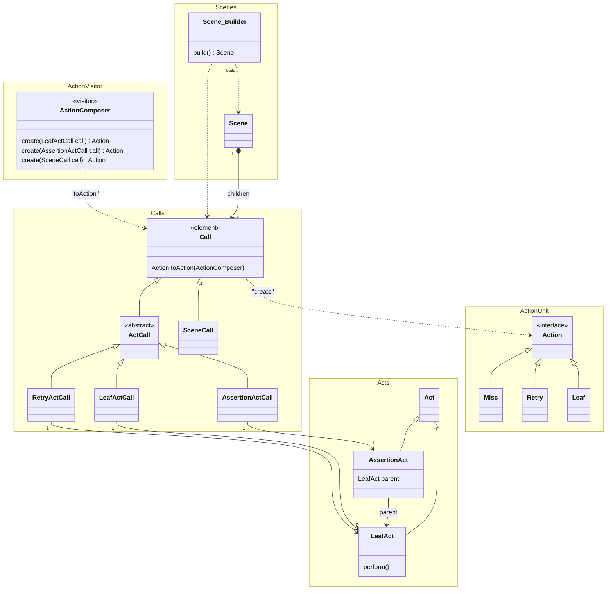

This is a package to provide "action" model of the **autotest-ca** framework.

Actions performed over the SUT are modeled as `ActionFactory` in the framework, which creates `Action` using the concept of **actionunit** library.

Since one instance of `ActionFactory` usually corresponds to one `Action` instance in the model of this framework, we use the terms **action** and **action factory** interchangeably in the documentation unless otherwise explicitly noted.

In the concepts of the **autotest-ca** framework, a test consists of two elements.
**Scenes** and **Acts**.

A **Scene** is a sequence of **Acts**.

Ideally, a test class consists of methods returning **Scenes** only, each of which constructs a **Scene** by calling methods to create **Acts**.
Then, each of those method calls has meaningful name with meaningful variable names for arguments.

Thus, the test class should become a readable code, yet can be executed efficiently because the framework understands dependencies among **Scenes** and can avoid unnecessary arrangement steps. 

Then **Acts** are categorized into **AssertionAct** and **LeafAct**.
**LeafAct** can be implemented by a test programmer, typically **SDET-FW**, to model a reusable real world action such as **Click**, **Navigate**, **Screenshot**, etc.  

**AssertionAct** and **LeafAct** have corresponding **Call** class, which are **AssertionActCall** and **LefActCall**.
However, not individual **Act** classes such as **Click**.

A **Scene** is a unit that the framework executes at the top level.
An **Act** is a unit of a behavior, that user can define as a Java code directly.

As the root class name **ActionFactory** suggests, these are defined to create **Action** instances.

**Call**s are only defined for structurally meaning elements such as **SceneCall**, **AssertionAct**, **AssertionActCall**, **LeafActCall** or **RetryCall**.

In order to process the hierarchical structure which is represented by the composite pattern formed by a class tree under **ActionFactory**, the tree and **ActionComposer** forms a Visitor pattern.

note for ActionComposer "''ActionComposer'' and ''Calls'' consists a ''Visitor'' pattern.
''ActionComposer'' traverses ''Calls'' one by one and creates action tree to be executed."
note for Call "A call is an 'element' in 'Visitor' pattern.
Typically visited by 'ActionComposer' and creates an action (actionunit).
A call is defined for structural action such as ''leaf'', ''assertion'', ''sequential'', ''retry'', and so on.
"
note for Act "Act is a class that represents user-defined activity."
