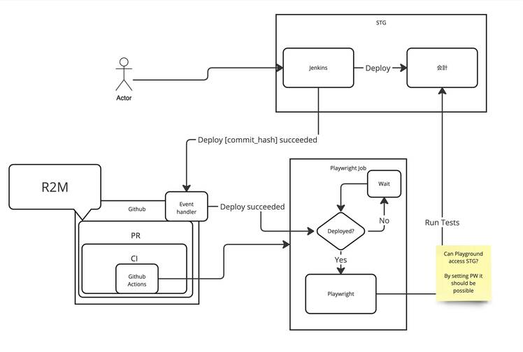

# PoC Overview

The goal of this PoC is to proof that Playwright can be integrated into the CI of ca_web.
Further, it should proof that it can replace "駄犬くん" in that it can execute at least the same kind of tests with at least the same performance.

## Draft Architecture Overview

## References

- [Draft: Playwright PoC Requirements](https://moneyforward.kibe.la/reviewable_drafts/6a29d1f8-837c-41fa-8806-ab6e6765e8ec)

