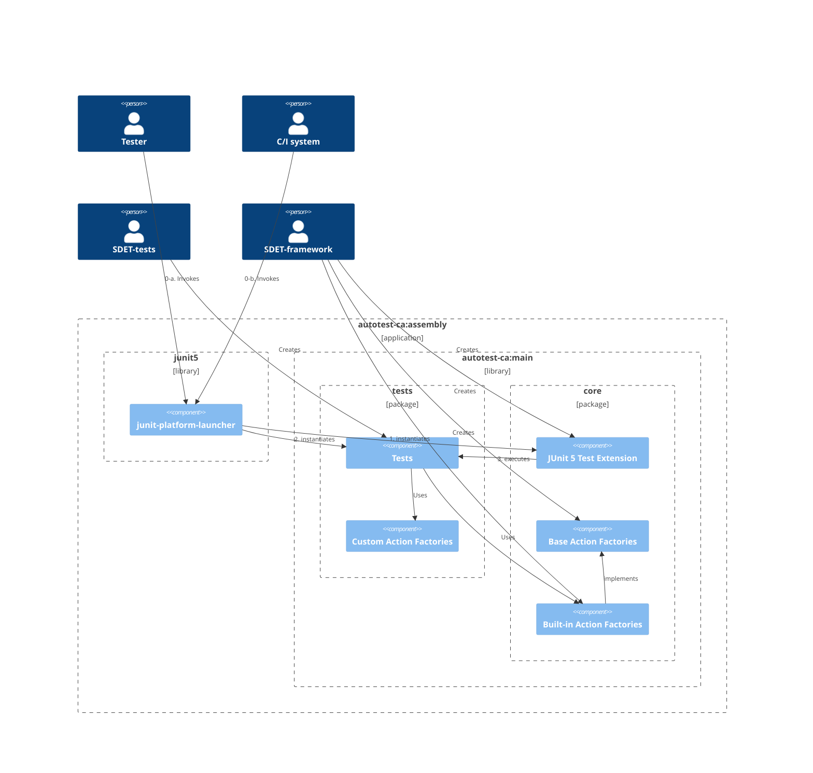

# Components

Following is a diagram that illustrates static structure of the `autotest-ca` application.
It is built as an executable assembly, which has all the necessary dependencies inside one file.

It is assumed that different set of people will work on each package.
`tests` will be developed by "SDET-tests", who are supposed to be assigned to a specific product/project and knowledgeable at its specifications and expertise in software testing.
the `core` will be developed by "SDET-framework", who are knowledgeable at general software engineering and software testing.

In the PoC, `tests` and `core` will be placed in the same library module, however, when it goes to production, they will be belonging to different modules and different repositories.
This separation will be done as the product gets matured.
