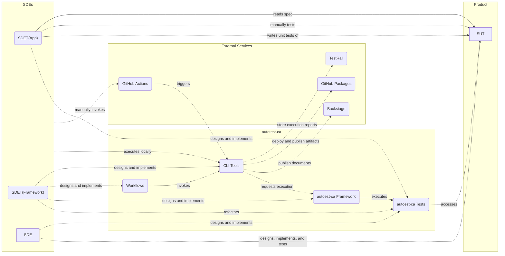
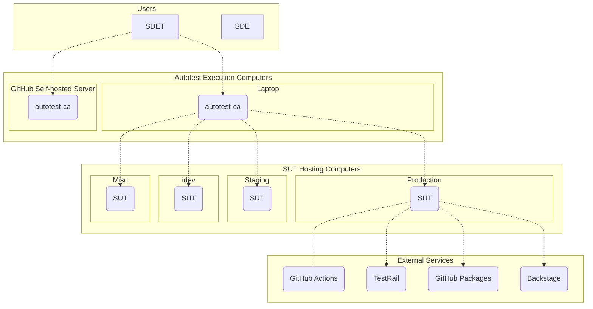

# Integration

*Logical Integration:*

```mermaid
graph LR
    subgraph "Product" 
        SUT
    end
    subgraph "SDEs"
        SDETapp
        SDETfw
        SDE
    end
    SDEs -.->|manually invokes| gha
    SDEs -.->|executes locally| autotest-cli
    SDE -.->|designs and implements| autotest-tests
    SDE -.->|designs, implements, and tests| SUT
    SDETapp("SDET(App)")
    SDETfw("SDET(Framework)")
    SDETapp -->|reads spec| SUT
    SDETapp -.->|manually tests| SUT
    SDETapp -.->|writes unit tests of| SUT
    SDETapp -.->|designs and implements| autotest-tests
    SDETfw -.->|designs and implements| autotest-cli
    SDETfw -.->|designs and implements| autotest-workflows
    SDETfw -.->|designs and implements| autotest-fw
    SDETfw -.->|refactors| autotest-tests
    subgraph "autotest-ca"
        autotest-tests("autoest-ca Tests")
        autotest-fw("autoest-ca Framework")
        autotest-cli("CLI Tools")
        autotest-workflows("Workflows")
    end
    autotest-workflows -.-> |invokes| autotest-cli
    autotest-cli -.->|store execution reports| testRail
    autotest-cli -.->|deploy and publish artifacts| ghPackages
    autotest-cli -.->|publish documents| backstage
    autotest-cli -.->|requests execution| autotest-fw
    autotest-fw -.->|executes| autotest-tests
    autotest-tests -.->|accesses| SUT
    subgraph "External Services"
        gha("GitHub Actions")
        testRail("TestRail")
        ghPackages("GitHub Packages")
        backstage("Backstage")
    end

    gha -.->|triggers| autotest-cli
```

*Physical Integration*

```mermaid
graph TD


    subgraph users [Users]
        SDET
        SDE
    end

    subgraph executors [Autotest Execution Computers]
      subgraph "Laptop"
          autotest-ca-laptop("autotest-ca")
      end
      subgraph "GitHub Self-hosted Server"
          autotest-ca-ghsh("autotest-ca")
      end
    end
    
    subgraph sutHost [SUT Hosting Computers]
        subgraph "Production"
            SUT-prod(SUT)
        end
        subgraph "Staging"
            SUT-stg(SUT)
        end
        subgraph "idev"
            SUT-idev(SUT)
        end
        subgraph "Misc"
            SUT-misc(SUT)
        end
    end
    
    subgraph "External Services"
        gha("GitHub Actions")
        testRail("TestRail")
        ghPackages("GitHub Packages")
        backstage("Backstage")
    end

    SDET -.-> autotest-ca-laptop
    SDET -.-> autotest-ca-ghsh

    autotest-ca-laptop -.-> SUT-prod
    autotest-ca-laptop -.-> SUT-stg
    autotest-ca-laptop -.-> SUT-idev
    autotest-ca-laptop -.-> SUT-misc

    SUT-prod -.-> testRail
    SUT-prod -.-> ghPackages
    SUT-prod -.-> backstage
    SUT-prod <-.- gha
```