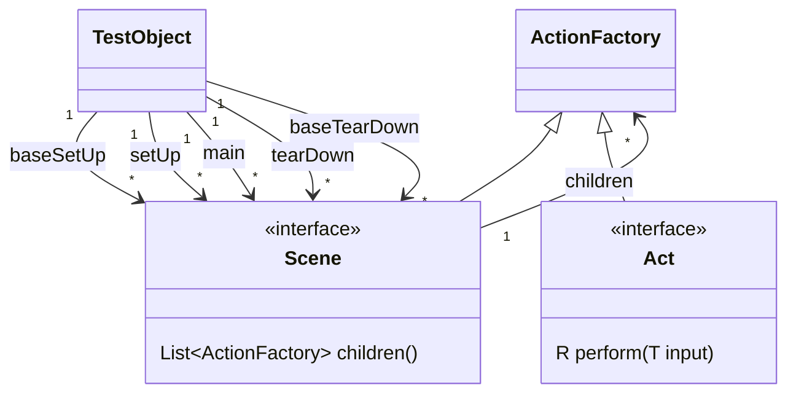
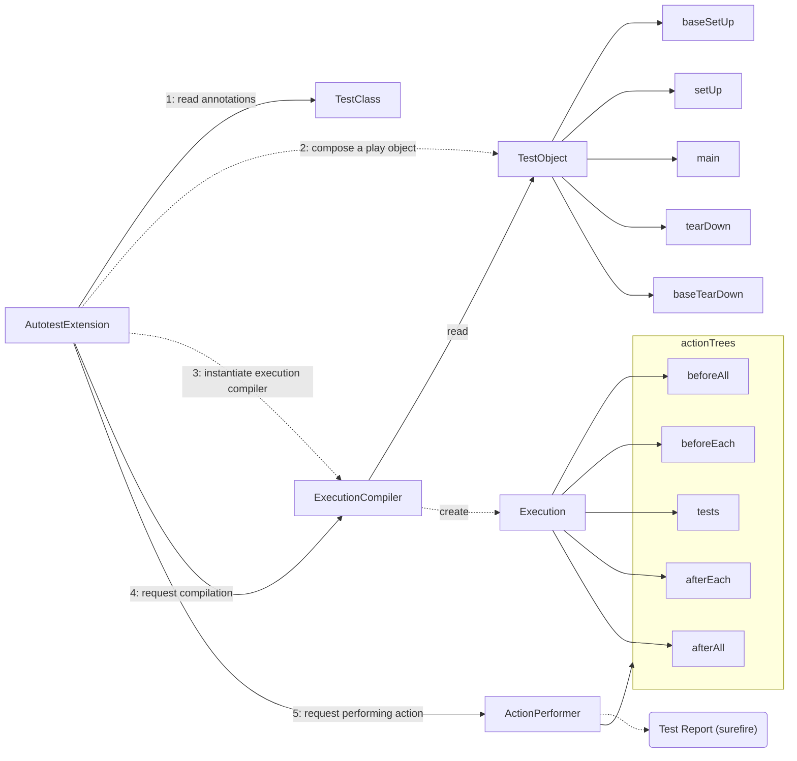

# Interactions between Components in **InsDog**

In the context of automated testing, various actions are defined and performed over and over again.
Sometimes, as a test case itself. 
Sometimes, as a test preparation step. 
Many of them look similar to each others but slightly different from each others.
This is why we need a good mechanism to compose a testing activity from smaller and reusable elements in a programmatic way.

One defined action can be performed in various ways.
For instance, an action to deploy a certain system is used for building SUT in a given environment, but it can also be a function to be tested.
If you run it as a test, you want to collect information about the deployment in order to examine the function works as expected.
Once a test fails in its set up phase, users want to run the phase as if it were a main part of the test to collect information.
If users know that the tests wouldn't fail and want to check the system's quality state quickly, they want to skip log collections.

Also, you need to make both the test report and the test code readable without creating repetitions at the same time.
On a failure, users want to see what is going on without being forced to repeat "run->fail->fix->run->" loop.
These are challenges not seen in product code, but only in automated testing tool's context.

To achieve such required flexibilities, **InsDog** employs the following mechanisms and design policies.

- `Act`, `Scene`, and `Call` structure
- Action compilation pipeline
- Custom `JUnit5` extension (custom test runner) and annotation based programming model

Note that code examples and class/sequence diagrams in this page are intended to describe the basic concepts and may be different from the product code in their implementation details.
Thus, even if a concept is described as a class in diagrams in this page, it may not have a corresponding implementation class in the code base.

## Scenes, Acts, and Test object

**InsDog** has units called `Act` and `Scene`, and they are essentially factories of actions.
An `Act` is a minimal unit to define an interaction with the system under test (SUT).
A `Scene` consists of one or more `Act` or `Scene`.
An `Act` can have zero or one input variable and zero or one output variable.
Input is read from a variable in a variable store.
A variable store is owned by a `Scene` and an `Act` belongs to a scene.

Following is a diagram that models relationships between `Act`, `Scene`, and `ActionFactory`.



`TestObject` is an instance of a test class.
A test class is the entry points that of your test, and it is what you write from!

As in many testing frameworks, you can define usual test phases; before all (baseSetUp), before each (setUp), test methods, after each (tearDown), and after all (baseTearDown). 

All of those are modeled as Java code in a way where programmers (typically SDETs) can minimize repetitions in the test code to keep the readability and maintainability.

### Act

An `Act` models a single action executed in a test scenario.
In the context of web-UI testing, actions such as "click", "sendKey", "waitFor", "doubleClick", etc. can be modeled as an `Act`.

Following is one example of `Act`, An implementation of `Click` class.

```java
public class Click implements Act<Page, Page> {
  private final String locatorString;
  
  public Click(String locatorString) {
    this.locatorString = locatorString;
  }
  
  @Override
  public Page perform(Page page, ExecutionEnvironment executionEnvironment) {
    page.click(locatorString);
    return page;
  }
}
```


Another example is of an `Act` is `Value`.
This class is used for assigning a specified value to a "context variable".

```java
class Value<T> implements Act<Void, T> {
  private final T value;

  public Value(T value) {
    this.value = value;
  }

  public T perform(Void value, ExecutionEnvironment executionEnvironment) {
    return this.value;
  }
}
```

### Scene

`Scene` is another unit of reusing actions in testing context.
It can hold other `ActionFactories`(either `Act` or `Scene`) as its children.

Following is an example to show how you can structure of a `Scene` through Java language. 

```java

public class AutotestExample {
  // This example assumes `Playwright` and `Browser` instances are initialized in a `@BeforeAll` method and
  // disposed in an `@AfterAll` method.
  static Playwright playwright;
  static Browser browser;
  
  @BeforeEach
  public Scene login() {
      return Scene.begin()
                  .add("page", new Value(browser.newPage()))
                  //                                                                                  input field name.                                                       
                  //   output field name      
                  .add("page", new Navigate("https://app.example.com/home"), "page")
                  .add("page", new Click("a#txtbox-email"), "page")
                  // ...
                  .build();
  }
}
```

As you see, you can add arbitrary children to a new scene using a `Scene.Builder` class's methods.
`Acts` and `Scenes` under a new `Scene` can communicate with each others through "context variables" at runtime.

The `Builder#add(...)` method can take at most three parameters.
An output field name from a child `ActionFactory` to be added, the child `ActionFactory`, and an input field name to the action factory.
When the output field name or the input field name is omitted, a constant "default context variable name" will be used. 

To define a function with multiple parameters, we need "currying" mechanism, which is not supported as of now.

### Test Object

Test Object is a concept to model the entire test, which consists of `setupAll`, `setUp`, `main`, `tearDown`, and `tearDownAll` action factories.
It is created by the test extension of **InsDog** internally and users do not need to create it by themselves in usual use cases.


## Action Compiler Pipeline

In order to modify/decorate the execution-time behavior of actions, **InsDog** has "Action Compiler" mechanism.



`Execution Compiler` compiles trees of `ActionFactories` into trees of actions, which can be performed by `ActionUnit`.
By replacing a default execution compiler with a custom one, you can control how your test is executed.

## References

- [JUnit5](https://junit.org/junit5/)
- [Four-Phase Test](http://xunitpatterns.com/Four%20Phase%20Test.html)
- [actionunit](https://github.com/dakusui/actionunit)


