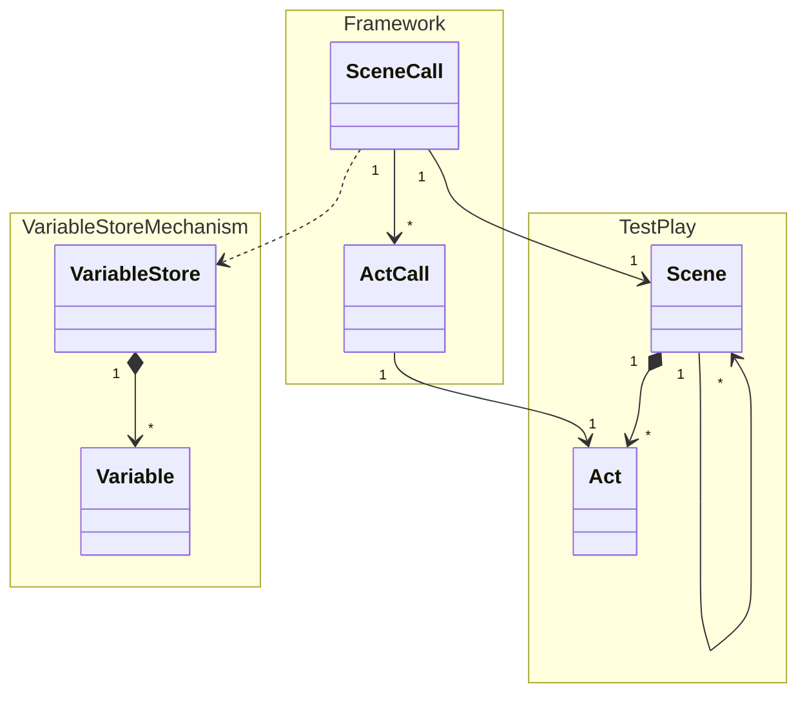
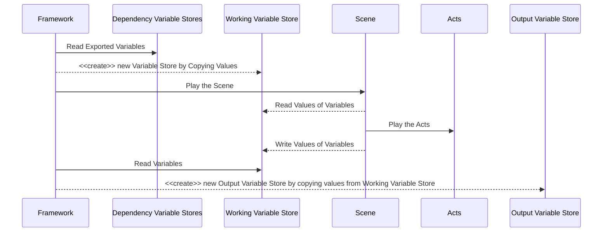

# Variable Store Mechanism

A `Scene` handles multiple `Acts`, each of which takes one input variable and ont output variable.
Therefore, as a whole a `Scene` may handle multiple variables.

At runtime (scene-performing time), `Scene` accesses a variable store.
That variable store is prepared by the framework.
There are two sorts of variables stores: one is "output variable store" and the other is "working variable store".
During its execution, `Scene` interacts only with the latter.
A "working variable store" is composed by the framework from the exported variables of scenes depended on by the scene for which it is created.

The framework composes a "working variable store" for a scene from variables exported by the scenes which the target scene depends on.

Following is a sequence diagram that describes this procedure.

Note that `Scene` doesn't play its child `Acts` directly but the framework takes care of it in the actual implementation.
For the simplicity's sake, we drew it in this way.